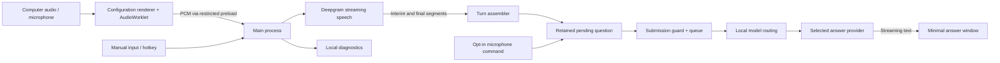

# Architecture

prateekAi is an Electron desktop application. Configuration, audio capture, credentials, question state, provider requests, and answer presentation have separate responsibilities. Cloud services are replaceable at the answer-provider boundary; speech currently uses Deepgram.

## Process boundaries

| Component | Responsibility |
|---|---|
| `main.cjs` | Owns sessions, source selection, question submission, queues, credentials, windows, preferences, diagnostics, and cancellation. |
| `renderer.js`, `pcm-worklet.js` | Configuration UI and browser audio capture; sends PCM through the preload bridge. |
| `preload.cjs` | Exposes a narrow IPC API. Main validates sender identity, page URL, and each window's allowed operations. |
| `speech.cjs` | Bounded audio streaming, speech connection state, finalization, and transcription events. |
| `audio-finality.cjs` | Tracks finalized audio intervals and unfinished tails separately for each source/connection timeline. |
| `turns.cjs` | Combines speech segments and classifies tasks, questions, incomplete fragments, acknowledgments, corrections, and contextual follow-ups. |
| `voice-fallback.cjs` | Matches optional phrases and retains a source/session-scoped pending question. |
| `routing.cjs` | Chooses a response route locally using question shape, context, user settings, and the authenticated model catalog. |
| `providers.cjs`, `provider-adapters.cjs` | Grounded answer instructions, provider request formats, streaming parsers, and normalized errors. |
| `oauth.cjs` | Supported ChatGPT connection lifecycle; stored client and host identities remain stable across branding changes. |
| `profile.cjs` | Profile path compatibility, encrypted credential persistence, and protection against unreadable or externally changed settings. |
| `content.js` | Question/answer presentation and limited controls. It cannot start audio capture or save credentials. |

## Audio and language

Live call mode uses computer loopback audio as the question source. Optional microphone audio supplies user context, and opt-in voice recovery requires microphone capture. Mic practice uses the microphone as the question source. A bot does not join the call.

English selects the English speech configuration; English + Hindi selects multilingual recognition. Language selection is configuration, not evidence that all accents, code-switching, identifiers, or numbers are recognized correctly. Live English and Hinglish acceptance remains a separate test gate.

Loopback captures computer output, including unrelated music or videos. A source label identifies an input channel, not a verified human speaker. Remote speech played over speakers can re-enter the microphone; use headphones and test echo conditions explicitly. A phone call taking place entirely on another device is not captured unless its audio is routed to this computer.

## A question survives transcript segmentation

An ASR final segment is not necessarily a complete question. “Can you explain” and “what closures are?” can be finalized separately. The turn assembler tracks source, audio timing, deduplication, and unfinished speech, then applies configurable settling rules.

Finalization covers audio intervals. A final result can end earlier than the preceding interim result, leaving a trailing constraint unfinished; this is documented in [Deepgram's interim-results example](https://developers.deepgram.com/docs/using-interim-results). The shared `AudioFinality` tracker subtracts only the covered interval. An explicit empty final Results packet can retract interim words within its own valid interval. UtteranceEnd cannot do so. A late interim wholly within an already finalized range is ignored defensively. Missing or invalid timestamps never acquire invented start-zero coverage; timestamp rounding has a 1 ms tolerance.

Pending-state clearing preserves finalized interval history, while a transport gap or session reset starts a new timeline. During recovery, new interims still establish unfinished coverage even before a fresh complete question is accepted. Dependent final clauses after a gap are rejected as question text but retain their audio-coverage information. This prevents a repeated question from submitting before its later constraint. Both finalized history and unfinished spans are bounded; overflow blocks submission and requests a complete repeat.

The pending buffer retains relevant question text independently of the latest transcript row. It is identified by session, source, ID, and revision. Background setup may be followed by an action or constraints. Acknowledgments such as “Did you get it?” do not become replacement technical questions. Explicitly new topics start a new problem; contextual fragments depend on prior question context.

Current safeguards include bounded question length, freshness checks, consumed revisions, incomplete/audio-gap state, and reset on session changes. After lost or incomplete audio, the app should request a complete repeat or manual input rather than confidently submit a fragment. These rules are implementation safeguards; the [test matrix](VOICE-TEST-MATRIX.md) defines how to verify their actual behavior.

## One submission path

Automatic, keyboard, and voice recovery converge on main-process submission checks. A question revision should be accepted once, even if an automatic completion decision and a voice command arrive together. The queue is bounded. Submitted text, provider, model route, and session identity are captured for the request; a later transcript row must not relabel an earlier answer.

Explicit manual questions can replace queued automatic work. Corrections must carry the corrected problem context and supersede outdated queued/in-flight answers where applicable. Stopping a session, changing provider/session identity, clearing context, or closing the answer window invalidates stale work. Cancelling a stream retains a clearly labelled partial answer.

Missing provider access, recognized quota/authentication errors, session limits, stale questions, or incomplete transcripts must produce a visible status instead of repeated paid attempts. No background classifier call or automatic retry to a different provider is part of model routing.

## Voice recovery

Voice recovery is optional and off by default. Default phrases include:

- “Give me a minute to think.”
- “Let me think through this for a moment.”
- “Let me work through this step by step.”
- “Ek minute, mujhe sochne dijiye.”

Only microphone-side final transcripts may execute a command. Interim fragments and split phrases are held while recognition finishes. Negated, quoted, or discussed phrases must not execute; replayed finals and repeated commands are guarded. A recognized phrase is removed from the submitted problem. The command submits retained question content, never a previous answer or invented question when no eligible pending question exists.

In Live call, the microphone command targets the retained remote question. In Mic practice, it targets the retained microphone question. If final text is still missing, the app requests finalization and waits only for a bounded interval. Failure to obtain the missing text must be visible and must not initiate an answer to a truncated question.

## Answer context and routing

The final question is the task. Recent conversation, candidate background, and role requirements are reference context. Role requirements are not evidence of personal experience; missing achievements or skills must not become invented first-person claims. Reference text cannot override the provider's grounding instructions.

Adaptive routing is a conservative local heuristic, not an independent intelligence assessment. An available lighter model may handle a short standalone definition; applied design, implementation, ambiguity, corrections, and contextual questions should retain the configured main model. Model selection stays within the configured provider and confirmed catalog. Turning adaptation off fixes the model to the user's selection. This is a testable policy, not proof of answer quality.

## Answer presentation

The content window subscribes to events and hydrates from a snapshot, with sequence checks preventing duplicate/stale state. One question header stays associated with its own answer. Safe Markdown is constructed from text nodes; model HTML is not executed. A new answer starts at the top, while incoming tokens preserve the reader's scroll position.

Setup and answers are separate windows. Opening Setup does not stop audio; hiding answers does not stop audio; closing answers does. Transparent-window resizing includes an explicit drag/keyboard grip. Content protection is requested at the native window boundary, but receiver-side screen-share validation is still required.

## Persistence and diagnostics

The profile resolver preserves an existing legacy profile, its encryption context, and OAuth identities. API keys and the ChatGPT account record are encrypted; role/background preferences are ordinary saved settings. A failed read/decryption prevents saving, and unexpected external modifications block a stale write. See [packaging and profile compatibility](../PACKAGING.md).

Session diagnostics are bounded in memory and exported locally only when requested. They include decisions, timing information, connection/command states, and recognized question text. They do not contain raw audio or credentials. Exports may still contain confidential conversation content; they are excluded from the repository and releases.

Schema version 2 includes an allowlisted settings snapshot, Auto-answer changes, and speech-progress metadata (event type, source, covered interval, unfinished intervals, and interim character count). Interim words are not copied into these progress events. A disabled Auto-answer setting and an incomplete-audio blocker have different decision reasons. Old exports lack these fields and cannot retrospectively establish which interim/VAD event caused a stall.

No live provider access is required to run the mocked unit/flow tests. Real Windows encryption tests use synthetic credentials in isolated profiles. Neither class of test establishes cloud ASR accuracy, real model correctness, acoustic echo handling, or Meet receiver visibility; those results belong in [LIVE-TEST-RESULTS.md](LIVE-TEST-RESULTS.md).
